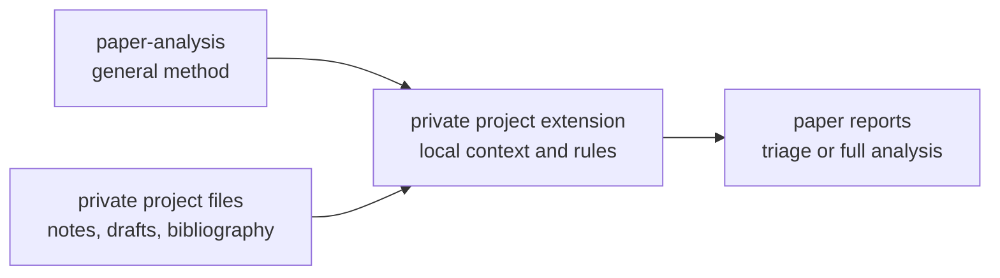

# Paper Analysis Skill

`paper-analysis` is a general Codex skill for reading academic papers as arguments. It helps Codex move beyond summary: identify the paper's question and thesis, reconstruct the argument, assess evidence, map objections and replies, place the paper in a debate, and screen the bibliography for follow-up reading.

The skill is project-neutral. It does not contain private research context, personal project files, or project-specific structure.

## What It Does

- Identifies the source, reading status, citation, and text reliability.
- Separates full-paper analysis from provisional analysis based on abstracts, excerpts, notes, or metadata.
- Rates project relevance when the user supplies project context.
- Reconstructs central arguments, premises, objections, replies, and evidence.
- Distinguishes the author's claims from the analyst's assessment.
- Places the paper relationally within a literature or debate.
- Screens bibliography items without treating unread sources as independent support.
- Produces concise triage reports or fuller paper-analysis reports.
- Proposes handoff candidates without editing project files unless the user authorizes it.

## Companion Skills

This public skill mentions only these companion skills:

- `pdf` for PDF extraction, OCR, rendering, pagination checks, figures, tables, and appendices.
- `zotero` for citation records, library metadata, bibliography export, and library lookup.
- `philosophy-writing` when analysis turns into drafting or revising philosophical prose.

Any project-specific workflow should live in a private extension, not in this repository.

## Install

Clone this repository into your Codex skills folder:

```bash
git clone https://github.com/Aaronlves/paper-analysis-skill.git ~/.codex/skills/paper-analysis
```

If you already have a local copy, update it with:

```bash
cd ~/.codex/skills/paper-analysis
git pull
```

## Usage Examples

```text
Use paper-analysis to read this paper, reconstruct its argument, and assess the evidence.
```

```text
Use paper-analysis to triage this article for my project. I only need a relevance score and the main reason.
```

```text
Use paper-analysis on this abstract only. Be explicit about what cannot yet be claimed without the full paper.
```

```text
Use paper-analysis to screen this paper's bibliography and identify the strongest sources to follow up.
```

## Output Pattern

The skill normally produces one of three outputs:

1. a thorough analysis report;
2. a concise triage report;
3. a provisional report when only limited material is available.

Reports keep bibliographic information in one `Metadata` citation field, avoid a duplicate final `References` section, and separate verified sources from follow-up leads.

## Private Extensions

If you want Codex to assess papers for a specific research project, create a separate private extension. The extension should supply project context, relevance criteria, file paths, templates, and write permissions. The general method should remain here.

Recommended pattern:



A minimal private extension can use this structure:

```text
project-paper-analysis/
├── SKILL.md
├── agents/
│   └── openai.yaml
└── references/
    ├── project-context.md
    ├── report-templates.md
    └── workspace-policy.md
```

Use this prompt to create one:

```text
Build a private project-specific extension for the installed `paper-analysis`
skill. Do not copy or rewrite the general paper analysis method. The extension
must use `paper-analysis` for general reading, argument reconstruction,
evidence checking, relevance triage, and bibliography screening, then add only
my local project context and workflow rules.

Create the extension as a separate skill named `[project-name]-paper-analysis`
in `[private skill directory]`. Keep it outside any public repository.

Include:

- the project question, thesis, and stable commitments;
- tentative hypotheses and open questions, clearly separated from stable claims;
- project-specific relevance criteria;
- preferred report templates;
- citation style and evidence rules;
- paths and naming conventions for private files;
- rules for when Codex may read, create, or update project files;
- privacy boundaries and material that must not be exported, searched, or published.

Design requirements:

1. Keep general paper-reading, argument-reconstruction, evidence-checking, and
   bibliography-screening rules in `paper-analysis`; do not duplicate them.
2. Make the extension trigger only when a paper is being assessed for this
   specific project.
3. Tell the agent to use both skills together: the extension supplies local
   project context, and `paper-analysis` supplies the general method.
4. Treat project notes as context, not as independent scholarly evidence.
5. Require verification before promoting claims from unread or second-hand
   sources into the project argument or literature review.
6. Preserve existing project files and conventions.
7. Do not create or update shared files unless the write policy authorizes it.
8. Put long project context in clearly named reference files and keep `SKILL.md`
   concise, with explicit instructions about when each reference must be read.
9. Include `agents/openai.yaml`, validate the finished skill, and report its
   private installation path and file structure.
10. Review the completed extension for personal or sensitive information before
    any publication. Default to keeping the entire extension private.

After creating it, show me a brief boundary audit: what remains in the general
skill, what lives in the private extension, and whether project-specific or
personal information appears outside the private directory.
```

## Repository Contents

```text
SKILL.md
agents/openai.yaml
README.md
```

## Repository

GitHub: <https://github.com/Aaronlves/paper-analysis-skill>
