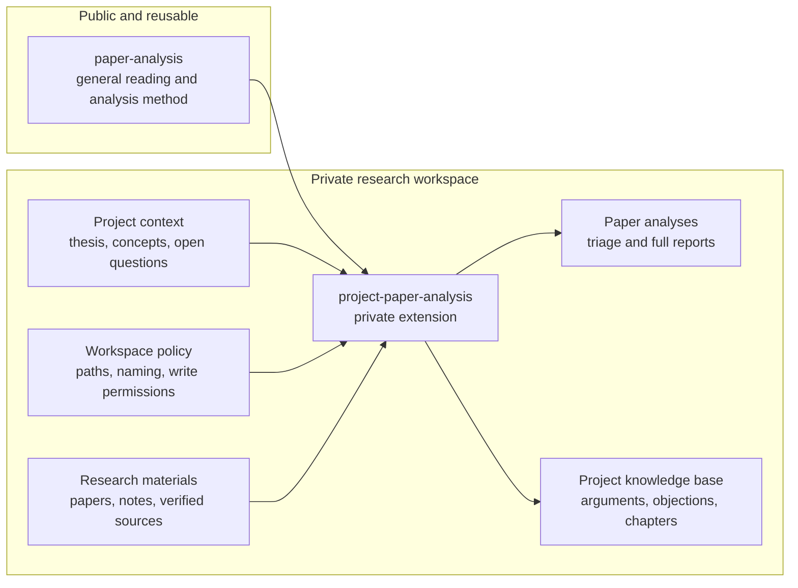

# Paper Analysis Skill

A general Codex skill for triaging and analyzing academic papers, especially philosophy papers, as arguments rather than neutral summaries.

The skill guides Codex to rate prospective relevance, choose an appropriate depth of reading, reconstruct argument structure, assess support, map objections and replies, extract key distinctions, screen bibliographies, and explain relevance to a research project when project context is provided.

## What It Helps With

- Reading and analyzing academic papers or PDFs
- Triaging papers with a project-relevance score
- Extracting a paper's central question and thesis
- Reconstructing arguments in premise-conclusion form
- Identifying objections, replies, unsupported premises, and weak inferences
- Assessing evidence, cases, conceptual distinctions, and methodology
- Placing a paper within a debate or literature-review narrative
- Screening references worth following
- Explaining how a paper supports, challenges, or complicates a project

## Install

Clone this repository into your Codex skills folder:

```bash
git clone https://github.com/Aaronlves/paper-analysis-skill.git ~/.codex/skills/paper-analysis
```

If you already have a local copy, update it with:

```bash
cd ~/.codex/skills/paper-analysis
git pull
```

## Usage

Ask Codex to analyze a paper, PDF, abstract, excerpt, or citation. For example:

```text
Read this paper in full, reconstruct its argument, and assess whether the support is sufficient.
```

```text
Analyze this philosophy paper and identify its central thesis, main premises, objections, and replies.
```

```text
Place this article in the debate and explain whether it is an ally, target, complication, or background source for my project.
```

```text
Extract the references worth following from this paper and explain why each one matters.
```

## Skill Contents

```text
SKILL.md              Core skill instructions
agents/openai.yaml    Codex UI metadata
```

## Add a Private Project Extension

This repository is intentionally project-neutral. For a full research workflow, keep this general skill unchanged and create a separate private skill that supplies your dissertation or project context. This prevents personal research information from entering a public fork and makes updates to the base skill easier to adopt.

### Recommended Private Project Architecture

The public skill supplies the reusable method. The private extension connects that method to a private research workspace without copying project information into the public repository.



A practical folder layout can look like this:

```text
private-research-project/
├── AGENTS.md                         # Tells Codex to use both skills
├── project-control/
│   ├── project-memory.md             # Stable commitments only
│   ├── project-status.md             # Current phase and priorities
│   └── workflow.md                   # Research and writing procedure
├── concepts/                         # Definitions and distinctions
├── arguments/                        # Premises and supporting arguments
├── objections-and-replies/           # Live objections and responses
├── chapters-or-sections/             # Draft prose
├── paper-analyses/                   # Saved triage and full reports
├── literature-map/                   # Debate and historical placement
├── bibliography/                     # Verified project references
└── .private-skills/
    └── project-paper-analysis/
        ├── SKILL.md                  # Concise controller
        ├── agents/
        │   └── openai.yaml           # Codex UI metadata
        └── references/
            ├── project-context.md    # Stable vs. tentative project claims
            ├── report-templates.md   # Project-specific output formats
            └── workspace-policy.md   # Paths, writes, and privacy rules
```

The names are illustrative. Use paths appropriate to your system, make the extension folder match the skill's `name`, and ensure `AGENTS.md` or your Codex configuration points to the private extension. Keep the whole project outside public repositories unless you have deliberately removed sensitive material.

Copy the prompt below into Codex. Replace the bracketed fields with your own information, and provide the relevant project files when asked. If the material is sensitive, keep the resulting extension outside any public repository.

```text
Use the skill-creator skill to build a private, project-specific extension for the
installed `paper-analysis` skill. Do not copy, rewrite, or weaken the general
paper-analysis workflow. The extension must invoke or defer to `paper-analysis`
for paper triage and analysis, then add only the local research context and
workflow rules needed for my project.

Create the extension as a separate skill named `[project-name]-paper-analysis`
in `[private skill directory]`. Before writing it, inspect the project materials
I provide and ask only for information that cannot be established from those
files. Do not place the extension inside the public paper-analysis repository.

Encode the following project-specific information:

- Project title and type: [title; dissertation, article, book, etc.]
- Central question: [question]
- Working thesis and major commitments: [claims]
- Chapter or section map: [structure]
- Key concepts and preferred definitions: [concepts]
- Live arguments, objections, and unresolved problems: [argument map]
- Relevant debates, authors, and historical scope: [literature]
- Project-specific relevance criteria: [what makes a paper score 0–5]
- Required analysis headings or templates: [output format]
- Citation style and evidence rules: [style]
- Paths and naming conventions for notes, analyses, bibliographies, argument
  maps, and reading queues: [paths and conventions]
- Rules for updating project files, including which changes require my explicit
  approval: [write policy]
- Privacy constraints and material that must never be quoted or exported:
  [privacy rules]

Design requirements:

1. Keep general paper-reading, argument-reconstruction, evidence-checking, and
   bibliography-screening rules in `paper-analysis`; do not duplicate them.
2. Make the extension's description trigger only when a paper is being assessed
   for this specific project.
3. Tell the agent to use both skills together, with the extension supplying
   project context and `paper-analysis` supplying the general method.
4. Separate stable project commitments from tentative hypotheses and open
   questions.
5. Treat project notes as context, not as independent scholarly evidence.
6. Require verification before promoting claims from unread or second-hand
   sources into the dissertation's argument or literature review.
7. Preserve existing project files and conventions; do not create or update
   shared files without authorization defined by the write policy.
8. Put long project context in clearly named reference files and keep SKILL.md
   concise, with explicit instructions about when each reference must be read.
9. Include `agents/openai.yaml`, validate the finished skill, and report its
   private installation path and file structure.
10. Review the completed extension for personal or sensitive information before
    any publication. Default to keeping the entire extension private.

After creating it, show me a brief boundary audit: what remains in the general
skill, what lives in the private extension, and whether any project-specific or
personal information appears outside the private directory.
```

## Core Principles

The skill guides Codex to:

- Read the full paper when available
- Survey before rating and reserve full analysis for papers that warrant it
- Distinguish the author's claims from the user's assessment
- Reconstruct the strongest plausible version of the argument before criticizing it
- Use page citations when pagination is available
- Avoid inventing quotations, page numbers, citations, or argumentative steps
- Treat debate placement as relations among claims, not just a list of authors
- Update project files only when the user asks or provides paths

## Repository

GitHub: <https://github.com/Aaronlves/paper-analysis-skill>
