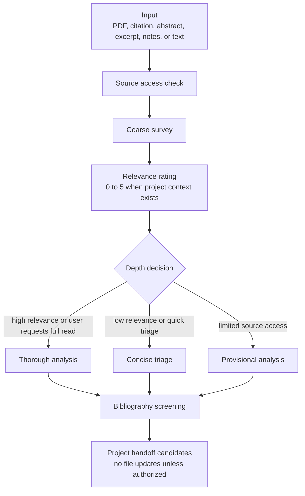

# Paper Analysis Skill

`paper-analysis` is a general Codex skill for reading academic papers as arguments. It helps Codex identify a paper's question, thesis, dialectical target, argument structure, evidence, objections, replies, contribution, and bibliography leads.

The repository is intentionally project-neutral. It does not contain private research context, personal file paths, project structure, or project-specific claims.

## What This Skill Is For

Use `paper-analysis` when you want Codex to do one or more of the following:

- triage a paper's relevance to a research question;
- distinguish full-paper analysis from abstract-only or excerpt-only analysis;
- identify the central question, thesis, and dialectical target;
- reconstruct arguments in premise-conclusion form when helpful;
- assess logical, conceptual, and evidential support;
- map objections and replies;
- place a paper in a debate or literature review;
- screen the bibliography for follow-up reading;
- explain how a source might support, complicate, or pressure a project;
- produce a concise triage report, thorough analysis report, or provisional limited-access report.

The skill is especially useful for philosophy papers, but its workflow also applies to other argumentative academic writing.

## Companion Skills

This public skill only names three optional companion skills:

- `pdf` for PDF extraction, OCR, page rendering, pagination checks, figures, tables, appendices, and visual verification.
- `zotero` for citation records, library metadata, bibliography export, and library lookup.
- `philosophy-writing` when analysis turns into drafting, revising, or evaluating philosophical prose.

Project-specific extensions, local file policies, and private research memory should live outside this repository.

## Installation

Clone the repository into your Codex skills folder:

```bash
git clone https://github.com/Aaronlves/paper-analysis-skill.git ~/.codex/skills/paper-analysis
```

If you already have a local copy, update it with:

```bash
cd ~/.codex/skills/paper-analysis
git pull
```

The skill folder should contain:

```text
paper-analysis/
├── SKILL.md
├── README.md
└── agents/
    └── openai.yaml
```

## Basic Usage

Ask Codex to use `paper-analysis` and provide a PDF, citation, abstract, excerpt, note, or pasted text.

Examples:

```text
Use paper-analysis to read this paper, reconstruct its argument, and assess the evidence.
```

```text
Use paper-analysis to triage this article for my project. I only need the relevance score, central thesis, and whether it is worth a full read.
```

```text
Use paper-analysis on this abstract only. Be explicit about what cannot yet be claimed without the full text.
```

```text
Use paper-analysis to screen this paper's bibliography and identify the strongest sources to follow up.
```

## Workflow Overview

The skill follows a staged workflow:



## Step 1: Establish Source Access

Before analyzing, Codex should state what it can actually inspect:

- full text available and readable;
- full text available but extraction unreliable;
- full text available but pagination unreliable;
- abstract or excerpt only;
- citation or metadata only;
- user notes only;
- unavailable, incomplete, or corrupted source.

This matters because the report should not claim full-paper analysis when only partial material was available. Page-specific claims require verified pagination. Quotations require checking against the source text.

## Step 2: Identify the Paper

When available, the report should record:

- one complete citation in the requested style, or APA 7 by default;
- version status: published, accepted manuscript, preprint, draft, or unknown;
- source file or supplied source location;
- source access status;
- selectable-text reliability;
- pagination reliability;
- relevant non-body materials, such as notes, tables, figures, appendices, or bibliography;
- reading status: coarse survey, thorough reading, or limited-access analysis.

The analyzed paper's bibliographic record belongs in one `Reference` field under `Metadata`. The report should not repeat the same bibliographic details in several fields or add a duplicate final `References` section.

## Step 3: Survey Before Rating

The first pass should survey the whole paper:

1. read the abstract, introduction, conclusion, headings, and explicit thesis statements;
2. skim every section;
3. inspect passages containing principal arguments, objections, evidence, conceptual machinery, and historical framing;
4. inspect relevant notes, figures, tables, appendices, or formal apparatus;
5. record the central question, thesis, dialectical target, argument route, and likely project use.

This prevents Codex from overrating a paper because of keywords in the title or abstract.

## Step 4: Rate Project Relevance

When the user supplies project context, the skill uses a 0-5 relevance scale:

| Score | Meaning |
| --- | --- |
| 0 | No identifiable use. |
| 1 | Remote topical overlap. |
| 2 | Limited background or bibliographic use. |
| 2.5 | Borderline; no clear argumentative role yet. |
| 3 | Clear use for a concept, premise, objection, case, or debate narrative. |
| 4 | Direct and substantial use in a live argument, section, or literature review. |
| 5 | Central source that materially shapes a thesis, core premise, or major objection and reply. |

The score measures usefulness for the user's project, not the paper's philosophical quality. A rating above 2.5 requires a specific prospective role.

If no project context exists, Codex should omit numerical relevance scoring unless the user asks for it.

## Step 5: Choose the Report Type

The skill normally produces one of three reports.

### Thorough analysis

Use this when the full text is available and the paper is substantially relevant or the user requests a full reading.

It should include:

- central concepts and distinctions;
- question, thesis, and dialectical target;
- argument reconstruction;
- premise support;
- logical, content, and evidence checks;
- strongest objection and reply;
- historical or literature placement;
- bibliography screening;
- project handoff candidates.

### Concise triage

Use this when relevance is low, the user asks for quick triage, or the paper does not yet warrant close reading.

It should include:

- Metadata;
- relevance rating and rationale;
- central question and thesis;
- main argumentative route;
- limited possible relevance;
- strongest references worth following;
- open questions.

### Provisional analysis

Use this when only an abstract, excerpt, citation, notes, or incomplete text is available.

It should clearly separate:

- what can responsibly be said;
- what cannot yet be claimed;
- likely question, thesis, or topic;
- possible project relevance;
- verification needed before stronger claims.

## Step 6: Reconstruct Arguments

The analysis should distinguish:

- the conclusion;
- explicit premises;
- suppressed premises;
- intermediate conclusions;
- inferential links;
- evidence for each major premise;
- objections and replies;
- remaining pressure points.

Premise-conclusion reconstruction is useful when it clarifies the argument. It should not be forced onto historical, interpretive, empirical, or methodological papers when another structure better captures the paper.

## Step 7: Check Concepts and Evidence

For central concepts, Codex should ask:

- What does the term mean in this paper?
- Why does the author introduce it?
- What argumentative work does it perform?
- Is it exhaustive, exclusive, stable, or contested?
- What nearby concept should it not be confused with?
- Does the author's usage differ from standard or neighboring uses?

For evidence, Codex should separate:

- logical support;
- conceptual support;
- empirical support;
- textual or historical support;
- methodological support;
- unsupported assertion;
- second-hand report requiring verification.

## Step 8: Place the Paper Relationally

A good report explains the paper's place in a debate. It should identify:

- the problem or earlier position to which the paper responds;
- allies, targets, and competitors;
- the paper's intervention;
- what changes after the intervention;
- what remains unresolved;
- which broader literature review or historical narrative it belongs to.

Do not replace this with a neutral author list. If the paper gives a history of a debate, cite it as the paper's own narrative and mark second-hand claims until original sources are checked.

## Step 9: Screen the Bibliography

Bibliography screening should prioritize references that:

- defend, attack, or clarify the main thesis;
- supply recurring distinctions or cases;
- represent major positions;
- provide foundational sources;
- constitute important recent interventions;
- are repeatedly relied on by the analyzed paper;
- are likely to affect the user's project.

Separate verified sources from follow-up leads. Never use an unread bibliography item as independent support.

## Step 10: Handle Project Handoffs Safely

When project context exists, the report may propose handoff candidates:

- possible project role;
- priority;
- where the paper might be used;
- how to use it;
- how not to use it;
- verification tasks before citation or file updates.

These are candidates, not completed updates. Codex should not edit argument maps, notes, bibliographies, reading lists, literature review files, or project memory unless the user explicitly authorizes those edits or provides a local workflow that authorizes them.

## Report Templates

### Thorough report

```markdown
# Author (Year): Short Title

## 1. Metadata
**Reference:** [Complete citation]
**Version status:**
**Source file:**
**Source access status:**
**Selectable-text reliability:**
**Pagination reliability:**
**Relevant non-body materials:**
**Reading status:** Thorough reading

## 2. Project Relevance Rating
## 3. Relations to the Project and Previous Literature
## 4. Concepts, Question, Thesis, and Dialectical Target
## 5. Arguments and Checks
## 6. Evidence and Evidence Check
## 7. Strongest Objection and Reply
## 8. Contribution and Historical Placement
## 9. Bibliography Screening
### Verified Sources Worth Using
### Follow-Up Leads Requiring Verification
## 10. Problems and Open Questions
## 11. Project Handoff Candidates
```

### Concise triage

```markdown
# Author (Year): Short Title

## Metadata
**Reference:** [Complete citation]
**Version status:**
**Source file:**
**Source access status:**
**Selectable-text reliability:**
**Pagination reliability:**
**Reading status:** Coarse survey and relevance triage

## Relevance Rating
## Gist
## Limited Project Relevance
## References Worth Following
## Open Questions
## Project Handoff Candidates
```

### Provisional analysis

```markdown
# Provisional Analysis: Author (Year): Short Title

## Metadata
**Reference:** [Complete citation if available]
**Source access status:** [abstract/excerpt/metadata/notes only]
**Reading status:** Provisional; limited to supplied material

## What Can Responsibly Be Said
## What Cannot Yet Be Claimed
## Likely Question, Thesis, or Topic
## Possible Project Relevance
## Verification Needed
## Project Handoff Candidates
```

## Quality Checklist

Before finishing, Codex should verify:

- source access status is accurate;
- reading status is coarse, provisional, or thorough;
- relevance rating has a concrete project-based rationale when project context exists;
- thesis and dialectical target are precise and charitable;
- major arguments are reconstructed rather than merely summarized;
- every major premise is connected to its support;
- logical, content, and evidence checks remain distinct;
- page citations and metadata are accurate where available;
- bibliographic information appears once in the Metadata citation;
- no separate final `References` section duplicates the analyzed paper's citation;
- author's claims, other sources' claims, analyst assessment, and project commitments remain separate;
- bibliography recommendations are screened and unread leads are labeled;
- handoff candidates do not pretend to be completed file updates;
- no unauthorized file updates were performed.

## Building a Private Project Extension

For a full research workflow, keep this public skill general and create a separate private extension. The extension should supply project context, relevance criteria, file paths, templates, and write permissions.

Recommended layout:

```text
project-paper-analysis/
├── SKILL.md
├── agents/
│   └── openai.yaml
└── references/
    ├── project-context.md
    ├── report-templates.md
    └── workspace-policy.md
```

Use this prompt to create one:

```text
Build a private project-specific extension for the installed `paper-analysis`
skill. Do not copy or rewrite the general paper analysis method. The extension
must use `paper-analysis` for general reading, argument reconstruction,
evidence checking, relevance triage, and bibliography screening, then add only
my local project context and workflow rules.

Create the extension as a separate skill named `[project-name]-paper-analysis`
in `[private skill directory]`. Keep it outside any public repository.

Include:

- the project question, thesis, and stable commitments;
- tentative hypotheses and open questions, clearly separated from stable claims;
- project-specific relevance criteria;
- preferred report templates;
- citation style and evidence rules;
- paths and naming conventions for private files;
- rules for when Codex may read, create, or update project files;
- privacy boundaries and material that must not be exported, searched, or published.

Design requirements:

1. Keep general paper-reading, argument-reconstruction, evidence-checking, and
   bibliography-screening rules in `paper-analysis`; do not duplicate them.
2. Make the extension trigger only when a paper is being assessed for this
   specific project.
3. Tell the agent to use both skills together: the extension supplies local
   project context, and `paper-analysis` supplies the general method.
4. Treat project notes as context, not as independent scholarly evidence.
5. Require verification before promoting claims from unread or second-hand
   sources into the project argument or literature review.
6. Preserve existing project files and conventions.
7. Do not create or update shared files unless the write policy authorizes it.
8. Put long project context in clearly named reference files and keep `SKILL.md`
   concise, with explicit instructions about when each reference must be read.
9. Include `agents/openai.yaml`, validate the finished skill, and report its
   private installation path and file structure.
10. Review the completed extension for personal or sensitive information before
    any publication. Default to keeping the entire extension private.

After creating it, show me a brief boundary audit: what remains in the general
skill, what lives in the private extension, and whether project-specific or
personal information appears outside the private directory.
```

## Repository Contents

```text
SKILL.md
agents/openai.yaml
README.md
```

## Repository

GitHub: <https://github.com/Aaronlves/paper-analysis-skill>
